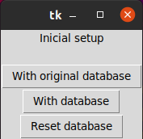
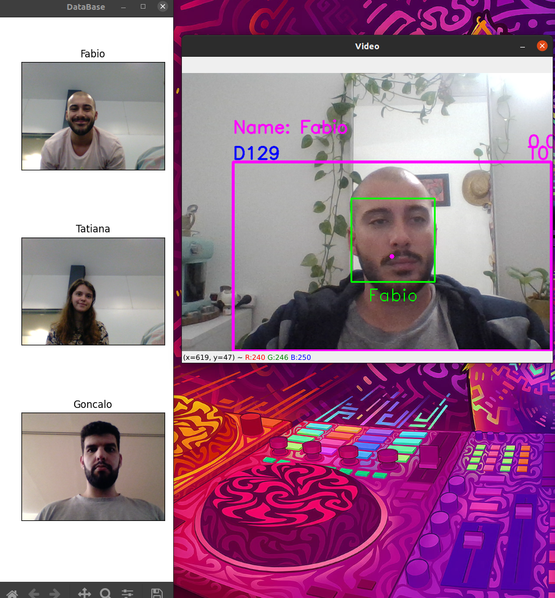
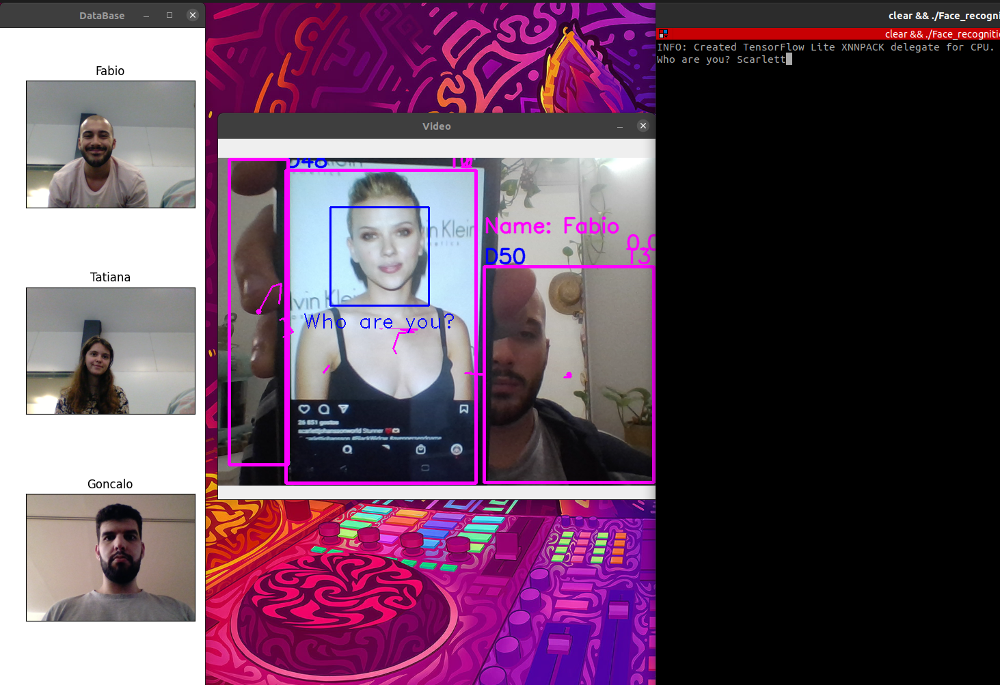
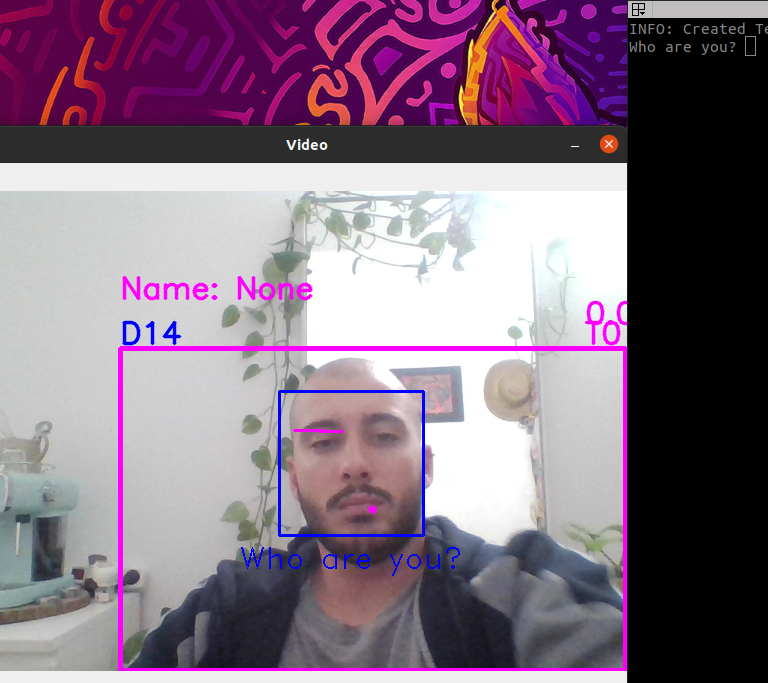

# Facial Recognition SAVI

This is a Facial Recognition program with tracking, made for the class "Industrial Vision Advanced Systems". 

This program is able, through the computer camera, to recognize faces and see if they are in the database. If don't, it will ask who they are and add them to the database. After recognizing a face, it will greet them. 
Even if the program can't see a face, it can detect persons and will track them while they are in the camera field of vision. Also after the recognizing, it associates the face to the body and will recognize the person body, even if it can't detect their face. While running, the program also displays the database in real time.
When detecting someone new, the program stops to ask who is the new person and to add them to the database, the user will be asked to insert this person name in the terminal.
At any point, the user can stop the program by clicking on the letter *'q'*.

It starts by asking the user which setup he wants. With this, the program can work in three different ways: 

The first one is the *'Original Database'*. In this mode, the program will only use the default database and won't add anyone to it. The default database contains only the team members that built the program.

The second option, *'With database'*, is able to detect new persons and add them to the database. When ran again, the new faces will still be in the database.

The third option, *'Reset database'*, will delete the database and the program starts without recognizing anyone.

With the video, the user can obtain information like the name of the person (if already in the database), the detection number and tracking number and the amount of time since last track, in seconds.

For it to work, it was necessary to create various functions, being __Face_recognition_tracking.py__ the principal, where the other functions are called. There are separate functions for facial recognition (_recognition.py_), for the body detection (_detector.py_), one for the selection menu (_initialization.py_) and it's variables (_MakeSomething.py_) and one for tracking (_functions2.py_)

